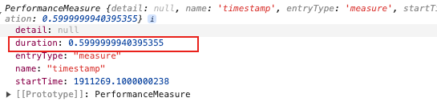

🔥从零手写vue2 - new Vue中发生了什么？

[专栏文章一 - 🔥从零手写vue2 - 虚拟节点以及createElement函数](https://juejin.cn/post/7421103437607370806)

[专栏文章二 - 🔥从零手写vue2 - template模板解析](https://juejin.cn/post/7427468776995012627)

[专栏文章三 - 🔥从零手写vue2 - 源码目录结构](https://juejin.cn/spost/7428128754571116583)

[专栏文章四 - 🔥从零手写vue2 - 窥探入口 && 源码构建](https://juejin.cn/post/7428888167276429353)

本专栏是打算从零手写一个 vue2，并学习 vue2 中的一些核心理念。

目前我们已经实现了下面的目录。

```js
my-vue2
├─shared
|   └util.js
├─platforms
|     ├─web
|     |  ├─entry-runtime-with-compiler-esm.js
|     |  ├─runtime-with-compiler.js
|     |  ├─runtime
|     |  |    └index.js
|     |  ├─compiler
|     |  |    └index.js
├─core
|  ├─index.js
|  ├─vdom
|  |  ├─create-element.js
|  |  └vnode.js
|  ├─util
|  |  ├─debug.js
|  |  ├─index.js
|  |  └lang.js
|  ├─instance
|  |    └index.js
├─compiler
|    ├─index.js
|    ├─parse
|    |   ├─html-parser.js
|    |   └index.js
|    ├─codegen
|    |    └index.js
```

# 一、构造函数中调用_init

在专栏上一篇中，我们知道了Vue就是一个构造函数。

当使用 new 关键字实例化的时候会调用构造函数内部的逻辑。

上篇我们说到在构造函数内部对是否使用 new 关键字进行判断。

还调用了实例上的_init方法。

```js
function Vue(options) { 
    if(__DEV__ && !(this instanceof Vue)){
      warn('Vue是一个构造函数，你应该使用 “new“ 关键字来调用')
    }
    this._init(options);
}
```

从 init 这个名字不难看出，肯定在内部做了一些初始化的操作。

这个方法在定义在initMixin中。

在Vue加载时在 ```instance/index.js``` 文件中调用了 initMixin 函数。
  
# 二、什么是实例？

在 _init 方法的第一步中获取了vue实例`const vm = this;`。

其实在很多地方都将 this 称作 vm 。

vm 在上下文中通常指的是“View Model”，这是 Vue实例的一个引用。

可以通过vm变量访问挂载到实例上的属性。

vue中的每一个组件都对应着一个 vue实例。

# 三、vm._uid 

```js
let uid = 0;

Vue.prototype.init=function(){
  vm._uid = uid++
}
```

每个 Vue实例都会有一个唯一的_uid（Unique Identifier，唯一标识符）。

这个标识符是在 Vue 实例创建时由一个递增的计数器生成的，其主要用途是在内部处理中提供唯一性。

尤其是在涉及到实例间的比较或者跟踪的时候。

# 四、追踪init消耗时间

```js
// init 函数刚执行时
let startTag, endTag
if (__DEV__ && config.performance && mark) {
  startTag = `vue-perf-start:${vm._uid}`
  endTag = `vue-perf-end:${vm._uid}`
  mark(startTag)
}
// init 函数初始化逻辑完成
if (__DEV__ && config.performance && mark) {
  mark(endTag)
  measure(`vue ${vm._uid} init`, startTag, endTag)
}
```

## 4.1 覆盖默认配置

我们知道在 vue 可以覆盖默认配置。

```js
// 开启 vue性能配置
Vue.config.performance = true;
```
那么 vue 是如何做到的呢？

`core/config.js`文件是vue的默认配置文件。

```js
// core/config.js
export default {
  // 默认不开启perf
  performance: false
}
```

在 `initGlobalAPI`方法中给 Vue设置了 config属性。

```js
export function initGlobalAPI(Vue){
    const configDef = {};
    configDef.get = () => config;

    if (__DEV__) {
        configDef.set = () => {
          warn(
            '不要替换Vue.配置对象，而是设置单独的字段'
          )
        }
    }

    Object.defineProperty(Vue,'config',configDef);
}
``` 
根据上面的配置可以知道 `Vue.config`获取的就是默认的配置信息。

export或export default一个对象时，对象的属性在外部脚本中都是可以修改的。 

export default的值在外部脚本中也是不能修改的，只是属性可以被修改。

所以你可以通过 `Vue.config.xxx = 'xxx'`来设置配置或者覆盖默认的配置。

## 4.2 mark函数 & measure函数

mark函数和 measure函数 是 vue中进行性能检测的函数。

函数位于`core/util/perf`文件中。

```js
// 判断是否在浏览器中
import { inBrowser } from './env'

export let mark
export let measure

// 只有在开发环境中才会设置 mark 和 measure
if (__DEV__) {
  const perf = inBrowser && window.performance 
  if (
    perf && 
    perf.mark && 
    perf.measure && 
    perf.clearMarks && 
    perf.clearMeasures
  ) {
    mark = tag => perf.mark(tag)
    measure = (name, startTag, endTag) => {
      perf.measure(name, startTag, endTag)
      perf.clearMarks(startTag)
      perf.clearMarks(endTag) 
    }
  }
}
```

实际上就是调用了window.performance相关的 api。

1. `performance.mark` 主要用于创建标记
2. `performance.measure` 主要用于记录两个标记的时间间隔
3. `performance.clearMarks` 用于清除标记

```js
window.performance.mark("_start")
for(let i=0;i<10000;i++){
  console.log();
}
window.performance.mark("_end")
window.performance.measure("timestamp","_start","_end")

// 可以获取直接间隔
window.performance.getEntriesByName("timestamp")[0]
```


可以使用getEntriesByName获取两个标记期间代码执行的时间。

## 4.3 总结

在 init 函数开始时打一个名为`“vue-perf-start”`的标记。

然后在逻辑处理结束后打一个名为`“vue-perf-end”`的标记。

最后通过measure函数设置一个 measure 对象，里面包含两个标记之间的间隔时间。

这个间隔时间就可以看成这个实例初始化花费的时间，以此来评测性能。 

# 五、vm._isVue

```js
Vue.prototype.init=function(){
  vm._isVue = true
}
```

每个 vue实例 在初始时都会设置_isVue变量。

这个变量可以在内部/扩展插件中判断当前对象是否是一个有效的 vue实例。

# 六、vm.__v_skip

在初始化时将该变量设置为 true。

这个变量用于指示 Vue的相应是系统跳过对该对象的观测。

当一个对象被标记为 __v_skip = true 时，Vue 不会对这个对象进行深度观测，这意味着对象内部的属性变化将不会触发视图更新。

```js
Vue.prototype.init=function(){
  vm.__v_skip = true
}
```

# 七、合并选项 options

```js
// 组件合并暂时不讨论
if(options && options._isComponent){

}else{
              
}
```

# 十、vm._self = vm

```js
Vue.prototype.init=function(){
  vm._self = vm
}
```

将_self属性指向自身这个实例。

可以确保在任何情况下都能正确引用当前实例。


