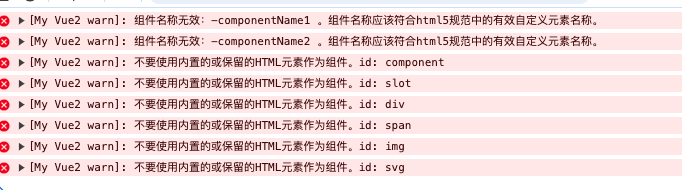
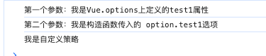

vue实例中的$options是一个很关键的属性，组件在渲染过程中需要的 directives、component的需要从这个属性上面获取。 

而vm.$options就是调用 mergeOptions 获取的。

```js
// 组件合并暂时不讨论
if(options && options._isComponent){

}else{
  vm.$options = mergeOptions(
    resolveConstructorOptions(vm.constructor),
    options || {},
    vm
  )         
}
```

## 7.1 mergeOptions

### 7.1.1 mergeOptions的使用场景

mergeOptions用于合并 2 个选项，不止在_init中调用。

所以理论上这个函数内部还包括了其他场景的逻辑。

搞清楚这些场景对理解 mergeOptions 的内部逻辑相当重要。

#### 7.1.1.1 场景一：实例化 vue调用_init方法

每当调用 `new Vue()`时，都会调用定义在实例上的_init方法。

```js
let options = {
  data:{},
  methods:{}
}
new Vue(options)
```
针对这种情况，就是将`传入的 options` 和 `Vue.options`进行合并。

#### 7.1.1.2 场景二：在 resolveConstructorOptions中调用

```js
function resolveConstructorOptions (Ctor) {
  var options = Ctor.options;
  if (Ctor.super) {
    var superOptions = resolveConstructorOptions(Ctor.super);
    var cachedSuperOptions = Ctor.superOptions;
    if (superOptions !== cachedSuperOptions) {
      // super option changed,
      // need to resolve new options.
      Ctor.superOptions = superOptions;
      // check if there are any late-modified/attached options (#4976)
      var modifiedOptions = resolveModifiedOptions(Ctor);
      // update base extend options
      if (modifiedOptions) {
        extend(Ctor.extendOptions, modifiedOptions);
      }
      //如果有继承关系
      options = Ctor.options = mergeOptions(superOptions, Ctor.extendOptions);
      if (options.name) {
        options.components[options.name] = Ctor;
      }
    }
  }
  return options
}
```

> 这种情况我们后面讨论

#### 7.1.1.3 场景三：在 Vue.mixin中调用

```js
export function initMixin(Vue: GlobalAPI) {
  Vue.mixin = function (mixin: Object) {
    this.options = mergeOptions(this.options, mixin)
    return this
  }
}
```

> 这种情况我们后面讨论

#### 7.1.1.4 场景四：在 Vue.extend中调用

```js
export function initExtend(Vue: GlobalAPI) {
  Vue.extend = function (extendOptions: any): typeof Component {
    Sub.options = mergeOptions(Super.options, extendOptions)
  }
}
```
> 这种情况我们后面讨论


### 7.1.2 合并传入的选项

```js
// 合并父级和子级的 options
export function mergeOptions(
    parent,
    child
){
  // 合并 parent child
}
```

### 7.1.3 校验组件名的正确性
```js
export function mergeOptions(
    parent,
    child,
    vm
){
  if(__DEV__){
    // 校验组件名的正确性
    checkComponents(child)
  }
}
```
在开发环境下校验组件名是否是合法规范的。

#### 7.1.3.1 checkComponents

该函数校验用户自定义的组件名是否符合规范。

遍历 options.components 然后依次调用 validateComponentName 进行验证。

```js
// 校验options.components组件选项
function checkComponents(options){
    for(const key in options.components){
        validateComponentName(key);
    }
}
``` 

#### 7.1.3.2 validateComponentName

```js
export function validateComponentName(name){
    if (
        !new RegExp(`^[a-zA-Z][\\-checkComponents\\.0-9_${unicodeRegExp.source}]*$`).test(name)
    ) {
        warn(
            `组件名称无效：${name} 。组件名称应该符合html5规范中的有效自定义元素名称。`
        )
    }
    if (isBuiltInTag(name) || config.isReservedTag(name)) {
        warn(
            `不要使用内置的或保留的HTML元素作为组件。id: ${name}`
        )
    }
}
```
上面是 validateComponent的具体逻辑。

其中校验了：

1. 不应该使用非规范的组件名。
2. 不应该使用内置的标签作为组件名。

#### 7.1.3.3 合法规范的组件名是怎么定义的

```js
new RegExp(`^[a-zA-Z][\\-checkComponents\\.0-9_${unicodeRegExp.source}]*$`)
```
这个正则定义了合法规范的组件名是怎么样的：

1. 字符串的第一个字符必须是字母（A-Z或 a-z）。
2. 第二个及之后的字符可以是 -、checkComponents、.、0-9、_ 以及由 unicodeRegExp 定义的 Unicode 字符。
3. 这些字符可以连续出现零次或多次。
4. 字符串的结尾必须符合上述规则。

#### 7.1.3.4 isBuiltInTag && makeMap

makeMap 函数则可以创建一个快速查找字符的映射函数。

所以isBuiltInTag 函数可以判断组件名是否是 slot或者 component。
 
```js
// 是否是内置组件
export const isBuiltInTag = makeMap('slot,component', true)
// 根据字符串创建一个快速查找映射，用于判断一个字符串是否属于预定义的一组关键字之一。
export function makeMap(
  str,
  expectsLowerCase
){
  const map = Object.create(null)
  const list = str.split(',')
  for (let i = 0; i < list.length; i++) {
    map[list[i]] = true
  }
  return expectsLowerCase ? val => map[val.toLowerCase()] : val => map[val]
}
```
#### 7.1.3.5 config.isReservedTag

该 config是`core/config`文件导出的对象。

之前我们提到过使用 `Vue.config.xxx` 可以设置 config文件中的值。

默认的 isReservedTag 默认是一个空函数。

```js
import { noop } from "./util"

export default {
  // 空函数
  isReservedTag: noop
}
```

在加载文件 `platforms/web/runtime/index`中覆盖了默认的配置。

```js
// 覆盖默认 isReserved内容
Vue.config.isReserved = isReserved;


// 判断是否是 html5 标签关键字
export const isHTMLTag = makeMap(
    'html,body,base,head,link,meta,style,title,' +
      'address,article,aside,footer,header,h1,h2,h3,h4,h5,h6,hgroup,nav,section,' +
      'div,dd,dl,dt,figcaption,figure,picture,hr,img,li,main,ol,p,pre,ul,' +
      'a,b,abbr,bdi,bdo,br,cite,code,data,dfn,em,i,kbd,mark,q,rp,rt,rtc,ruby,' +
      's,samp,small,span,strong,sub,sup,time,u,var,wbr,area,audio,map,track,video,' +
      'embed,object,param,source,canvas,script,noscript,del,ins,' +
      'caption,col,colgroup,table,thead,tbody,td,th,tr,' +
      'button,datalist,fieldset,form,input,label,legend,meter,optgroup,option,' +
      'output,progress,select,textarea,' +
      'details,dialog,menu,menuitem,summary,' +
      'content,element,shadow,template,blockquote,iframe,tfoot'
)

// 判断是否是 svg 相关标签
export const isSVG = makeMap(
    'svg,animate,circle,clippath,cursor,defs,desc,ellipse,filter,font-face,' +
      'foreignobject,g,glyph,image,line,marker,mask,missing-glyph,path,pattern,' +
      'polygon,polyline,rect,switch,symbol,text,textpath,tspan,use,view',
    true
)

// 判断是否是保留字标签
export const isReservedTag = (tag)=> {
  return isHTMLTag(tag) || isSVG(tag)
}
```
可以看出来 这个函数就是判断是否是关键字。

#### 7.1.3.6 测试一下

```js
const vm = new Vue({
    components:{
        "-componentName1":"a",
        "-componentName2":"a",
        "component":"a",
        "slot":"a",
        "div":"a",
        "span":"a",
        "img":"a",
        "svg":"a"
    }
});
```

我们这里使用了一些不符合命名规范的组件名。

会在控制台出现这样的报错信息。



### 7.1.4  将 child 转成普通对象

```js
// 判断是否是一个函数
export function isFunction(value){
  return typeof value === 'function'
}
// 如果 child是函数 
if (isFunction(child)) {
  child = child.options
}
```

该函数的目的是检查 child是否是一个函数，如果是函数，则将其转换为其 options属性。

通常 child就是一个包含 options属性的对象。

那么在什么场景下会走这段逻辑呢？

1. 组件构造函数

如果 child是一个构造函数（如 Vue.extend 创建的构造函数），则 child本身是一个函数，此时需要将其转换为它的options属性，以便进一步处理。

```js
const MyComponent = Vue.extend({
  template: '<div>My Component</div>',
  data() {
    return {
      message: 'Hello Vue!'
    };
  }
});

mergeOptions({},MyComponent)
```

2. 普通函数

如果 child 是一个普通的函数，通常不是预期的组件配置对象，但处于灵活性考虑，也可以将其转换为其 options属性。

### 7.1.5 normalizeProps规范 props

该函数主要作用是确保组件的 props 选项规范化。

在我们编写props属性时，可以定义成数组形式或者对象形式。

通过规范化处理，无论 props是数组还是对象形式，最终都会转换成一个具有 type属性的对象。

这样可以方便地进行类型检查和其他相关的处理逻辑。

```js
function normalizeProps(options, vm) {
    const props = options.props;
    if (!props) return
    const res = {};
    let i, val, name
    if (isArray(props)) {
        i = props.length;
        while (i--) {
            val = props[i]
            if (typeof val === 'string') {
                name = camelize(val)
                res[name] = { type: null }
            } else if (__DEV__) {
                warn('当使用数组语法时，每一项必须是字符串。')
            }
        } 
    }else if (isPlainObject(props)) {
        for (const key in props) {
            val = props[key]
            name = camelize(key)
            res[name] = isPlainObject(val) ? val : { type: val }
        }
    }else if (__DEV__) {
        warn(
          `Invalid value for option "props": expected an Array or an Object, ` +
            `but got ${toRawType(props)}.`,
          vm
        )
    }
    options.props = res
}
```
1. 如果props是一个数组，遍历数组。将数组里面的每一项当做对象的 key，value为`{type:null}`。

```js
// 数组形式
const vm = new Vue({ 
    props:['a','b','c']
});
// 规范化后
props = {
  a:{ type: null},
  a:{ type: null},
  a:{ type: null},
}
```

2. 如果props是一个对象，遍历对象。赋值对应的 key-value。

```js
// 对象形式
const vm = new Vue({ 
    props:{
        a:"String",
        b:{
            type:"Boolean"
        }
    }
});
props = {
  a:{ type:"String" },
  b:{ type:"Boolean"}
}
```

#### 7.1.5.1 camelize 函数

在转化过程中，将每一个 propName 由“-”写法改成小驼峰。

```js
/**
 * 将“-“写法转成驼峰 my-props => myProps
 */
const camelizeRE = /-(\w)/g
export const camelize = cached((str) => {
  return str.replace(camelizeRE, (_, c) => (c ? c.toUpperCase() : ''))
})
```

#### 7.1.5.2 cached 函数

cached函数通过创建一个缓存对象并在每次调用时检查缓存，实现了对纯函数的高效执行。

当下次输入相同时直接返回存储的结果，不会再次执行函数，优化了性能。

```js
/**
 * 创建一个纯函数的缓存版本。
 */
export function cached(fn) {
  const cache = Object.create(null)
  return function cachedFn(str) {
    const hit = cache[str]
    return hit || (cache[str] = fn(str))
  }
} 
```

#### 7.1.5.3 isPlainObject 函数

这个函数用于检测一个对象是否是一个普通的 JavaScript 对象。

```js
const _toString = Object.prototype.toString

// 该函数可以判断obj是否是对象
export function isPlainObject(obj) {
  return _toString.call(obj) === '[object Object]'
}
```
#### 7.1.5.4 toRawType 函数

该函数可以获取一个值的类型。

```js
export function toRawType(value) {
  return _toString.call(value).slice(8, -1)
}
```

### 7.1.6 normalizeInject规范 inject

```js
function normalizeInject(options, vm) {
    const inject = options.inject
    if (!inject) return
    const normalized = (options.inject = {})
    if (isArray(inject)) {
      for (let i = 0; i < inject.length; i++) {
        normalized[inject[i]] = { from: inject[i] }
      }
    } else if (isPlainObject(inject)) {
      for (const key in inject) {
        const val = inject[key]
        normalized[key] = isPlainObject(val)
          ? extend({ from: key }, val)
          : { from: val }
      }
    } else if (__DEV__) {
      warn(
        `inject属性应该传入数组类型或者对象类型，但是现在的类型为` +
          `但是现在为${toRawType(inject)}.`
      )
    }
}
```

和 props一样，inject也支持 传递数组和对象。

与 props唯一不同的是生成的对象值属性由 type变成了 from。

* extend 用于合并2个对象

```js
/**
 * 往目标对象中合并属性
 */
export function extend(
  to,
  _from
) {
  for (const key in _from) {
    to[key] = _from[key]
  }
  return to
}
```
### 7.1.7 normalizeDirectives 规范化指令

这个函数确保每个自定义指令都具有标准的方法结构，即使最初定义时只是一个简单的函数。

```js
/**
 * 规范化自定义指令
 */
function normalizeDirectives(options) {
    const dirs = options.directives
    if (dirs) {
      for (const key in dirs) {
        const def = dirs[key]
        if (isFunction(def)) {
          dirs[key] = { bind: def, update: def }
        }
      }
    }
}
```

1. 假设定义成函数

```js
const options = {
  directives: {
    focus: function(el) {
      el.focus();
    }
  }
};

normalizeDirectives(options);

// 规范化后
console.log(options.directives); // 输出：{ focus: { bind: [Function], update: [Function] } }
```

### 7.1.8 处理 extends 和 mixins

> 这里后续我们说完 extends和 mixins后会进行补充。

### 7.1.9 合并策略

前面我们介绍了对 child 和 parent 上的属性进行校验和处理。

```js
export function mergeOptions(){
  const options = {}
  let key
  for (key in parent) {
    //parent中所有key值属性和child的key值属性进行合并
    mergeField(key)
  }
  for (key in child) {
    if (!hasOwn(parent, key)) {
      //parent中没有，child中有的
      mergeField(key)
    }
  }
  function mergeField(key) {
    const strat = strats[key] || defaultStrat
    options[key] = strat(parent[key], child[key], vm, key)
  }
  return options
}
```

上面这段逻辑是合并的核心代码，实际上就是生成一个 options 对象。

然后遍历parent和 child 然后调用mergeField 往 options添加合并后的属性。

#### 7.1.9.1 策略函数的参数

```js
strat(parent[key], child[key])
```

策略函数的第一个参数是 `Vue.options`中的值 ，而第二个参数是 `构造函数中传入的options`中的值。

#### 7.1.9.2 自定义策略optionMergeStrategies

可以看到 mergeField内部引用了一个 strats变量，上面定义了不同属性的策略函数。

这个 strats 是引用 config配置的一个变量，所以支持用户自定义合并策略。

```js
// config.js
export default {
  optionMergeStrategies:Object.create(null)
}
// 引用 config配置 支持用户自定义
let strats = config.optionMergeStrategies;
```

上一小节我们说到，策略函数的第一个参数是 Vue.options中的值，第二个参数是 Vue构造函数中传的 options选项。

我们自定义函数看看是否可以成功。

```js
Vue.config.optionMergeStrategies.test1 = (parent,child)=>{
    console.log("第一个参数："+parent);
    console.log("第二个参数："+child);
    return '我是自定义策略'
}

Vue.options.test1 = "我是Vue.options上定义的test1属性";
let vm = new Vue({
  test1:'我是构造函数传入的 option.test1选项'
})

console.log(vm.$options.test1);// 我是自定义策略
```


发现生效。

#### 7.1.9.3 默认的合并策略
 
如果遇到没有定义策略的 key值，则使用默认策略。

```js
// 默认的策略
const defaultStrat = function (parentVal, childVal){
  return childVal === undefined ? parentVal : childVal
}
```

上面的逻辑很简单，就是如果 child有值，取 child；否则取 parent。

这是一个覆盖的策略，即 child有的话直接进行覆盖。

我们将上节的例子去掉自定义策略拿过来测试一下，如果是没有设置策略的 key，子 option直接覆盖父 option。

```js
Vue.options.test1 = "我是Vue.options上定义的test1属性";
const vm = new Vue({ 
    test1:'我是构造函数传入的 option.test1选项'
}); 

console.log(vm.$options.test1); // 我是构造函数传入的 option.test1选项
```
可以看到和预期的一样。

#### 7.1.8.4 el 和 propsData的合并策略

```js 
if (__DEV__) {
    strats.el = strats.propsData = function (
      parent,
      child,
      vm,
      key
    ) {
      if (!vm) {
        warn(
          `选项“${key}”只能在实例期间使用 使用new关键字创建。`
        )
      }
      return defaultStrat(parent, child)
    }
}
```

可以看出来 el和 propsData使用的依旧是默认策略，只是在期间提示了只有在 new Vue期间才能使用 el和 propsData属性。

#### 7.1.8.5 data的合并策略
